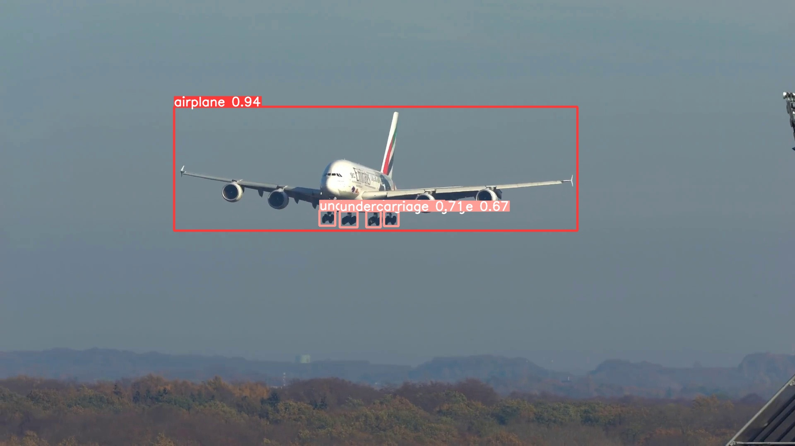

<H1 align="center">Real-time detection algorithm for aircraft landing gear</H1>

## Steps to run Code

- Install
```
conda create -n <name> python==3.8
conda activate <name>
```

- Clone the repository
```
git clone https://github.com/cm199831/aircraft-landing-gear.git
```

- Goto the cloned folder.
```
cd aircraft-landing-gear
```

- Install the dependecies
```
pip install -e.
```

- Run the code using the command mentioned below(for real-time detection).
```
python predict.py
```

### Aircraft Landing Gear Detection

#### Sample Image:


#### Demo Video:
<video width="600" controls>
  <source src="./demo.mp4" type="video/mp4">
  <source src="./demo.webm" type="video/webm">
  Your browser does not support the video tag.
</video>


